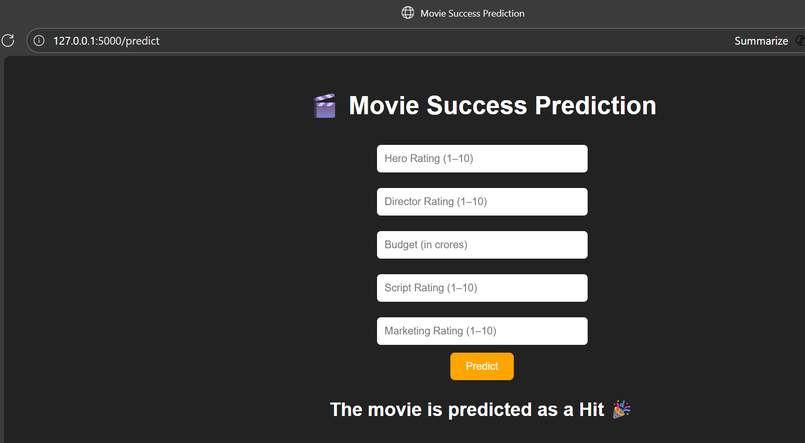

# 🎬 Movie Success Prediction App

A simple ML-inspired project that predicts whether a movie will be a **Hit 🎉** or **Flop 💔** based on ratings like hero, director, budget, etc.

## 🚀 Tech Stack
| Component | Technology |
|---------|------------|
Frontend | HTML, CSS (Inline)
Backend | Python, Flask
Logic | Simple weighted formula (Mock ML)
Deployment | Local Flask server

## 📸 Project Preview

If you like this project ⭐ star the repo!
